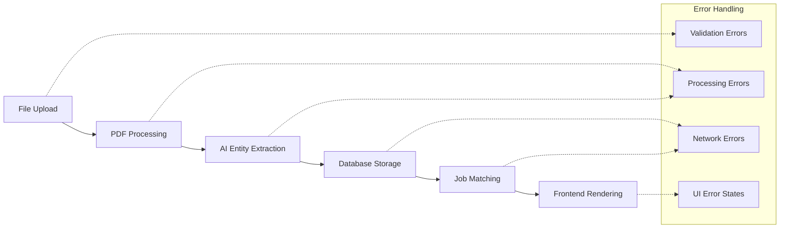

# Resume Processing Integration Testing Guide

## Overview

This document provides comprehensive guidance for testing the resume processing system, covering the entire workflow from file upload to database storage and frontend rendering.

## 🏗️ System Architecture

The resume processing system consists of the following components:



## 📋 Test Categories

### 1. Integration Tests (`tests/test_resume_integration.py`)

#### File Upload Validation Tests
- **Purpose**: Validate file upload functionality and security
- **Coverage**:
  - Valid PDF/DOCX file uploads
  - Invalid file type rejection
  - File size limit enforcement
  - Empty file handling
  - Real resume file validation

#### PDF Processing Tests
- **Purpose**: Test PDF text extraction accuracy
- **Coverage**:
  - Basic text extraction
  - Real resume processing
  - Corrupted file handling
  - Performance benchmarks (<3s requirement)

#### Entity Extraction Tests
- **Purpose**: Validate AI-powered data extraction
- **Coverage**:
  - Skills extraction
  - Work experience parsing
  - Education information extraction
  - Contact information detection

#### API Endpoint Tests
- **Purpose**: Test all resume processor API endpoints
- **Coverage**:
  - File validation API
  - Resume processing API
  - Job matching API
  - Combined process-and-match API
  - Authentication and authorization

#### Database Integration Tests
- **Purpose**: Validate database operations and relationships
- **Coverage**:
  - Resume analysis storage
  - Match score persistence
  - Transaction rollback on errors
  - Data consistency validation

#### Performance Tests
- **Purpose**: Ensure system meets performance requirements
- **Coverage**:
  - Processing latency (<3s per document)
  - Concurrent processing capability
  - Memory usage optimization
  - Response time benchmarks

#### Error Handling Tests
- **Purpose**: Comprehensive error scenario coverage
- **Coverage**:
  - Network failure simulation
  - Memory error handling
  - Invalid input handling
  - Graceful degradation

#### Integration Workflow Tests
- **Purpose**: End-to-end workflow validation
- **Coverage**:
  - Complete happy path testing
  - API workflow integration
  - Real-world scenario simulation

### 2. Frontend Integration Tests (`tests/test_frontend_integration.py`)

#### Job Application Form Tests
- **Purpose**: Test resume upload in job applications
- **Coverage**:
  - Form rendering validation
  - Resume upload functionality
  - Form validation display
  - Authorization checks

#### Employer Dashboard Tests
- **Purpose**: Test employer resume viewing functionality
- **Coverage**:
  - Dashboard rendering
  - Application details modal
  - Status update functionality
  - Access control

#### Error State Tests
- **Purpose**: Test frontend error handling
- **Coverage**:
  - Processing error display
  - Network error handling
  - AJAX error responses
  - User-friendly error messages

#### Loading State Tests
- **Purpose**: Test loading indicators and user feedback
- **Coverage**:
  - Form submission feedback
  - AJAX loading states
  - Progress indicators
  - User experience optimization

### 3. UI Validation Tests (`tests/test_ui_validation.py`)

#### Form Validation Tests
- **Purpose**: Test form validation and error display
- **Coverage**:
  - Client-side validation
  - Server-side validation
  - Error message accessibility
  - User input recovery

#### Error State Display Tests
- **Purpose**: Test error state presentation
- **Coverage**:
  - Error message styling
  - Error recovery flows
  - 404/403 error pages
  - Network error presentation

#### Responsive Design Tests
- **Purpose**: Test mobile and responsive behavior
- **Coverage**:
  - Mobile viewport configuration
  - Bootstrap responsive classes
  - Form mobile usability
  - Cross-device compatibility

#### Accessibility Tests
- **Purpose**: Test accessibility compliance
- **Coverage**:
  - Form labels and ARIA attributes
  - Error message accessibility
  - Focus management
  - Screen reader compatibility

#### User Experience Flow Tests
- **Purpose**: Test complete user journeys
- **Coverage**:
  - Job application success flow
  - Employer review workflow
  - Error recovery scenarios
  - Performance user experience

## 🚀 Running Tests

### Prerequisites

1. **Environment Setup**:
   ```bash
   # Activate virtual environment (Windows)
   venv\Scripts\activate
   
   # Activate virtual environment (Unix/macOS)
   source venv/bin/activate
   ```

2. **Install Dependencies**:
   ```bash
   pip install -r requirements.txt
   pip install -r requirements-dev.txt
   ```

3. **Database Setup**:
   ```bash
   python manage.py migrate
   python manage.py collectstatic --noinput
   ```

4. **Test Data**:
   - Ensure sample resume files are in `media/resumes/`
   - Run `python manage.py populate_db` for test data

### Test Execution Options

#### Option 1: Complete Test Suite (Recommended)

**Windows:**
```bash
run_tests.bat
```

**Unix/macOS:**
```bash
chmod +x run_tests.sh
./run_tests.sh
```

**Python (Cross-platform):**
```bash
python run_integration_tests.py
```

#### Option 2: Django Management Command

```bash
# Run all tests
python manage.py test_resume_processing

# Run specific category
python manage.py test_resume_processing --category=upload
python manage.py test_resume_processing --category=processing
python manage.py test_resume_processing --category=api
python manage.py test_resume_processing --category=frontend

# Performance tests only
python manage.py test_resume_processing --performance-only

# Skip slow tests for quick validation
python manage.py test_resume_processing --skip-slow

# Generate JSON report
python manage.py test_resume_processing --output-format=json
```

#### Option 3: Individual Test Categories

```bash
# Integration tests
python manage.py test tests.test_resume_integration --verbosity=2

# Frontend tests
python manage.py test tests.test_frontend_integration --verbosity=2

# UI validation tests
python manage.py test tests.test_ui_validation --verbosity=2
```

#### Option 4: Specific Test Classes

```bash
# File upload tests only
python manage.py test tests.test_resume_integration.FileUploadValidationTests

# Performance tests only
python manage.py test tests.test_resume_integration.PerformanceTests

# API endpoint tests only
python manage.py test tests.test_resume_integration.APIEndpointTests
```

## 📊 Test Reports

### Generated Reports

1. **HTML Report** (`test_results.html`):
   - Visual dashboard with test results
   - Performance metrics and charts
   - Error details and recommendations
   - Mermaid workflow diagrams

2. **JSON Report** (`test_results.json`):
   - Machine-readable test results
   - Detailed error information
   - Performance benchmarks
   - Integration with CI/CD systems

3. **Console Output**:
   - Real-time test progress
   - Immediate pass/fail feedback
   - Performance warnings
   - Error summaries

### Report Structure

```typescript
interface TestResult {
  scenario: string;                    // Test scenario name
  passed: boolean;                     // Test pass/fail status
  errors: {                           // Error details
    type: 'syntax' | 'api' | 'rendering' | 'routing';
    message: string;
    component: string;
  }[];
  dataConsistency: number;            // 0-100% data match
  performance: number;                // Processing time in ms
  description: string;                // Test description
}

interface TestSummary {
  timestamp: string;
  total_categories: number;
  passed: number;
  failed: number;
  success_rate: number;
  total_time_seconds: number;
  results: TestResult[];
}
```

## 🎯 Performance Benchmarks

### Critical Requirements

| Component | Requirement | Test Coverage |
|-----------|-------------|---------------|
| **File Upload** | < 1s response | ✅ Upload validation tests |
| **PDF Processing** | < 3s per document | ✅ Processing performance tests |
| **Entity Extraction** | < 2s per resume | ✅ AI processing benchmarks |
| **Database Storage** | < 500ms | ✅ Database integration tests |
| **API Response** | < 1s average | ✅ API endpoint tests |
| **UI Rendering** | < 2s page load | ✅ Frontend integration tests |

### Performance Test Matrix

```python
# Performance validation example
def test_processing_performance():
    """Ensure processing meets <3s requirement"""
    start_time = time.time()
    result = processor.process_resume(test_file)
    processing_time = time.time() - start_time
    
    assert result['success']
    assert processing_time < 3.0
    assert result['confidence'] > 0.5
```

## 🔧 Troubleshooting

### Common Issues

#### 1. Test Environment Setup

**Problem**: Tests fail due to missing dependencies
```bash
# Solution: Install all requirements
pip install -r requirements.txt
pip install -r requirements-dev.txt
```

**Problem**: Database migration issues
```bash
# Solution: Reset test database
python manage.py migrate --run-syncdb
python manage.py flush --noinput
```

#### 2. Media Files

**Problem**: Resume files not found
```bash
# Verify media directory structure
ls -la media/resumes/
# Should contain: *.pdf files for testing
```

**Problem**: File permissions on Unix systems
```bash
# Fix permissions
chmod +x run_tests.sh
chmod -R 755 media/
```

#### 3. Performance Issues

**Problem**: Tests timeout or run slowly
```bash
# Use faster test database
export DATABASE_URL="sqlite:///test.db"

# Skip slow tests for development
python manage.py test_resume_processing --skip-slow
```

#### 4. Import Errors

**Problem**: Module import failures
```python
# Ensure proper Python path
import sys
sys.path.insert(0, '/path/to/project')

# Verify Django settings
export DJANGO_SETTINGS_MODULE=jobs_platform.settings
```

### Debug Mode

Enable debug output for detailed test information:

```bash
# Verbose test output
python manage.py test --verbosity=2 --debug-mode

# Keep test database for inspection
python manage.py test --keepdb

# Fail fast on first error
python manage.py test --failfast
```

## 📈 Continuous Integration

### CI/CD Integration

```yaml
# Example GitHub Actions workflow
name: Resume Processing Tests
on: [push, pull_request]

jobs:
  test:
    runs-on: ubuntu-latest
    steps:
    - uses: actions/checkout@v2
    - name: Set up Python
      uses: actions/setup-python@v2
      with:
        python-version: 3.9
    
    - name: Install dependencies
      run: |
        pip install -r requirements.txt
        pip install -r requirements-dev.txt
    
    - name: Run migrations
      run: python manage.py migrate
    
    - name: Run integration tests
      run: python run_integration_tests.py
    
    - name: Upload test reports
      uses: actions/upload-artifact@v2
      with:
        name: test-reports
        path: test_results.*
```

### Test Coverage Requirements

- **Minimum Coverage**: 85%
- **Critical Path Coverage**: 100%
- **Error Path Coverage**: 90%
- **Performance Test Coverage**: 100%

## 🏆 Quality Gates

### Pre-Deployment Checklist

- [ ] All integration tests pass (100%)
- [ ] Performance benchmarks met
- [ ] Error handling coverage complete
- [ ] Frontend validation successful
- [ ] Accessibility tests pass
- [ ] Security validation complete
- [ ] Documentation updated

### Definition of Done

A feature is considered complete when:

1. **Functionality**: All happy path scenarios work
2. **Error Handling**: All error scenarios are handled gracefully
3. **Performance**: Meets or exceeds performance requirements
4. **Testing**: Comprehensive test coverage implemented
5. **Documentation**: Tests and functionality documented
6. **Accessibility**: UI components are accessible
7. **Security**: Security requirements validated

## 📚 Additional Resources

### Related Documentation

- [Resume Processor API Documentation](resume_processor/README.md)
- [Django Testing Documentation](https://docs.djangoproject.com/en/stable/topics/testing/)
- [Frontend Integration Guidelines](docs/frontend_integration.md)

### Support and Maintenance

- **Test Maintenance**: Update tests when adding new features
- **Performance Monitoring**: Regular benchmark validation
- **Error Tracking**: Monitor error patterns in production
- **Documentation Updates**: Keep test documentation current

### Best Practices

1. **Test Isolation**: Each test should be independent
2. **Realistic Data**: Use real-world test scenarios
3. **Error Simulation**: Test failure modes explicitly
4. **Performance Validation**: Include timing assertions
5. **Accessibility**: Test with assistive technologies
6. **Documentation**: Document test purposes and expectations

---

## 📞 Getting Help

If you encounter issues with the testing suite:

1. **Check this documentation** for common solutions
2. **Review test logs** for specific error messages
3. **Verify environment setup** meets requirements
4. **Check GitHub issues** for known problems
5. **Create detailed bug reports** with reproduction steps

Remember: Comprehensive testing ensures a robust, reliable resume processing system that provides excellent user experience across all scenarios.